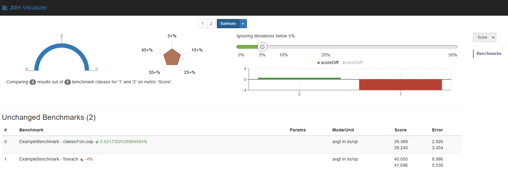

# Java Microbenchmark Harness playground

## Pre-requisites (one time setup)
1. Install `Java 23`
2. Install `Python 3.12` (check `.python-version` file)
3. Create python virtual environment `python -m venv .venv`
4. Activate virtual environment `source .venv/Scripts/activate`
5. Install nodeenv `pip install nodeenv`
6. Install node 22 `nodeenv -p --node=22.13.1` (for supported NodeJS versions check https://nodejs.org/en/about/previous-releases)
7. Install node http server `npm install http-server -g`

## Compare results between benchmarks
We will use `org.max.jmh.ExampleBenchmark` as our main benchmark class:

1. Build maven project using `./mvnw clean package`
2. Run 1st benchmark and save result in JSON file `java -jar target/benchmarks.jar ExampleBenchmark -rf json -rff jmh-result-1.json`
3. Modify benchmarked code and run the 2nd benchmark `java -jar target/benchmarks.jar ExampleBenchmark -rf json -rff jmh-result-2.json`
4. Activate python virtual environment `source .venv/Scripts/activate`
5. Navigate to scripts folder `cd scripts` and run `./compare_jmh_results.sh jmh-result-1.json jmh-result-2.json`

